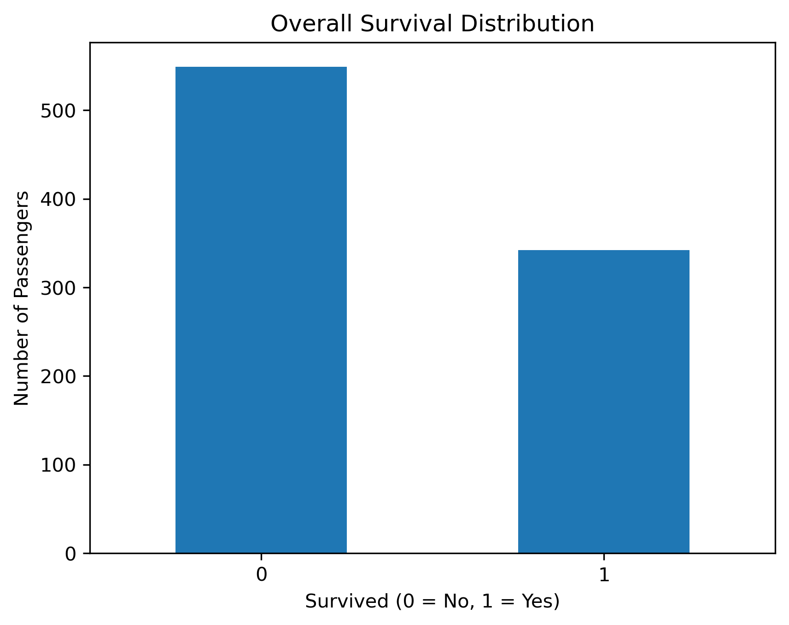
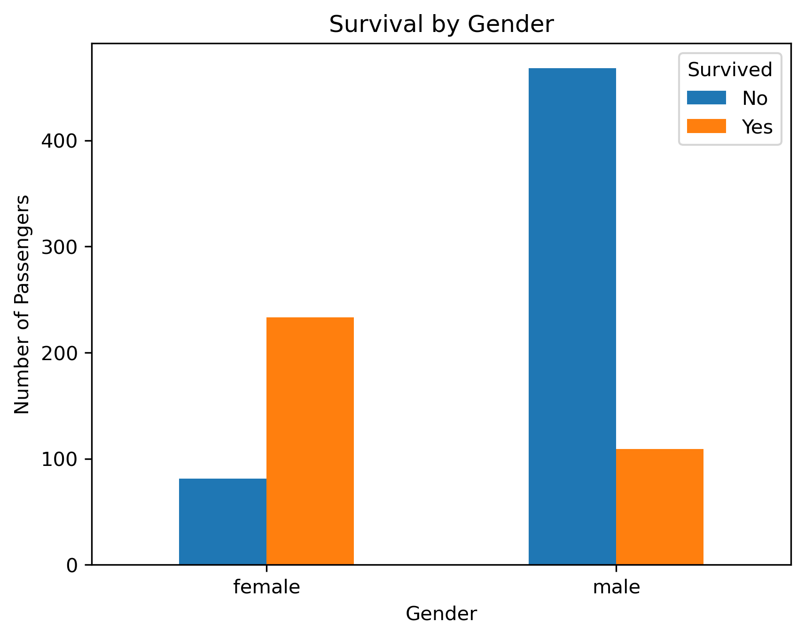
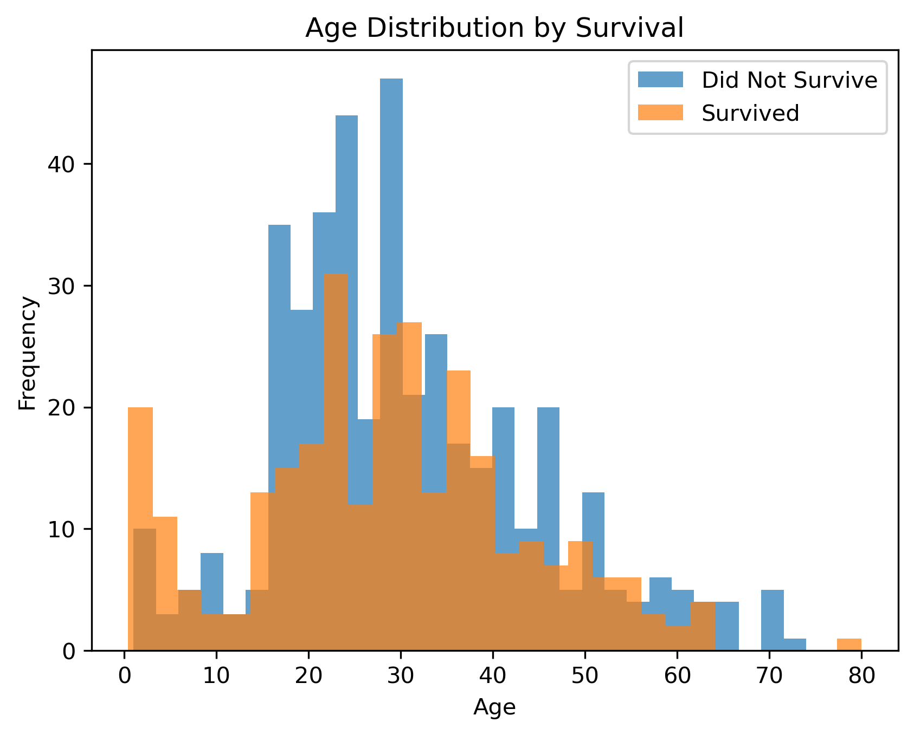

# Titanic-Survival-Prediction
End-to-end data science project using the Titanic dataset: data cleaning, EDA, feature engineering, and machine learning.

## Dataset Overview
- PassengerId → Unique ID

- Survived → Target variable (0 = No, 1 = Yes)

- Pclass → Passenger class (1st, 2nd, 3rd)

- Sex → Male or Female

- Age → Passenger age

- SibSp → Number of siblings/spouses onboard

- Parch → Number of parents/children onboard

- Fare → Ticket fare

- Embarked → Port of embarkation

## Size and Structure of Data
The dataset contains information on 891 passengers with 3 identifiers, 4 numerical features and 5 categorical features.

## Exploratory Data Analysis

### Overall Survival Distribution

📌 Insight: More passengers did not survive → dataset is imbalanced.

### Survival by Gender

📌 Insight: Females had a much higher survival rate than males.

### Survival by Passenger Class

📌 Insight: First-class passengers survived significantly more than third-class.

### Age Distribution by Survival

📌 Insight: Survivors skew slightly younger, but age is less dominant than gender or class.